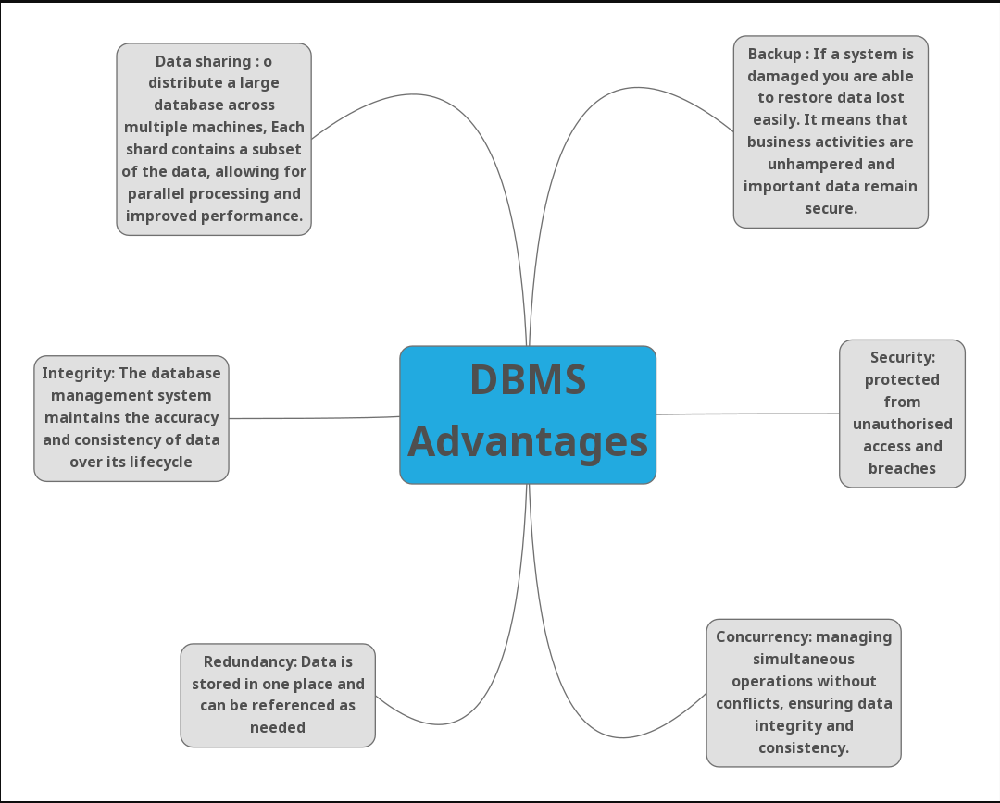

# Database Search and Reporting Task
## Objective
###  *Flat File Systems vs Relational Databases*
| Storage Type             | Structure                     | Data Redundancy |  Relationships | Drawbacks |
| -------------------------| --------------------------                | ----------------          | --------------                | ----------|
| 1. Flat File Systems     | file that contains a single table of data |  High Data Redundancy     |  no relationship              | Harder to Change Data Format, Poor at Complex Queries, requiring all records to have the same fields, less data consistency,one user can access data at a time.     |          
| 2. Relational Databases  | database with one or more tables          |  Low Data Redundancy      | relationship between tables   | more complex with varying costs, huge size     |

### *DBMS Advantages Mind Map*

###  Roles in a Database System 
Explaining each of the following roles: 
• System Analyst: 
  - A system analyst is responsible for collection requirements and analyzing business needs. They work closely with stakeholders, they analysis requirements to ensure that the system aligns with organizational goals.
• Database Designer: 
  - A database designer is responsible for design the structure and organization of a database. They design the schema, define relationships between tables, and ensure data integrity and efficiency in data storage. 
• Database Developer: 
  - A database developer is responsible for codeing and optimizing SQL queries, creating stored procedures, and implementing database solutions. They work on the technical aspects of database development and ensure that the database meets performance and scalability requirements.
• DBA (Admin): 
  - A DBA (Database Administrator) is responsible for managing and maintaining the database system. They handle tasks such as installation, configuration, backup and recovery, performance tuning, and security management. DBAs ensure that the database operates smoothly and efficiently.
• Application Developer: 
  - An application developer is responsible for creating software applications that interact with the database. They design and develop user interfaces, implement business logic, and ensure that the application can effectively retrieve and manipulate data from the database.
• BI Developer: 
  - A BI (Business Intelligence) developer is responsible for designing and implementing data analysis and reporting solutions. They work with data warehousing, ETL (Extract, Transform, Load) processes, and create dashboards and reports to provide insights into business performance.

## Additional Research Topics to Include in the Report
### Types of Databases 
• Relational vs Non-Relational (e.g., MongoDB, Cassandra)
- Relational: 
  - Structuring information in tables, rows, and columns.
  - Uses SQL for querying
  - Examples: MySQL, PostgreSQL, Oracle
- Non-Relational: 
  - store data as individual, unconnected files and can be used for complex, unstructured data types, such as documents or rich media files.
  - Uses various query languages (e.g., MongoDB uses BSON)
  - Examples: MongoDB, Cassandra, Couchbase

• Centralized vs Distributed vs Cloud Databases 
- Centralized database: 
  - All data is stored in a single location, typically on a server.
  - Easier to manage and secure but can be a single point of failure.
- Distributed database: 
  - Data is distribute across multiple locations or servers.
  - Provides redundancy and improved performance but can be more complex to manage.
- Cloud database: 
  - Data is stored in the cloud and accessed over the internet.
  - Offers scalability and flexibility but may raise concerns about data security and privacy.
• Use case examples:
	-  Relational: 
		- Banking systems, e-commerce platforms, and any application requiring complex queries and transactions.
	-  Non-Relational: 
		- Social media platforms, content management systems, and applications with large volumes of unstructured data.
	-  Centralized: 
		- Small businesses with limited data needs and resources.
	- Distributed: 
		- Large organizations with multiple locations or data centers.
	-  Cloud: 
		- Startups and businesses looking for cost-effective and scalable solutions.
### Cloud Storage and Databases
**What is Cloud Storage and how does it relate to databases?**

- Cloud storage is a service that allows users to store and access data over the internet. It uses remote servers to save data, Users can access data in Cloud Storage through an internet connection and software .Thus, provides scalable and flexible storage solutions without the need for physical hardware.
- Cloud databases are databases that are hosted and managed in the cloud. They can be either relational or non-relational and provide similar benefits as cloud storage, such as scalability, flexibility, and cost-effectiveness. Cloud databases allow users to access and manage their data from anywhere with an internet connection.
- Cloud storage and databases are often used together to provide a complete data management solution. Cloud storage can be used to store large volumes of unstructured data, while cloud databases can be used to manage and query structured data. This combination allows organizations to leverage the benefits of both technologies for their data needs.

**Advantages and Disadvantages of using cloud-based databases (e.g., Azure SQL, Amazon RDS, Google 
Cloud Spanner):**

- Advantages:
	- Scalability: Cloud databases can easily scale up or down based on demand, allowing organizations to handle varying workloads without the need for physical hardware upgrades.
	- Cost-effectiveness: Cloud databases often operate on a pay-as-you-go model, reducing upfront costs and allowing organizations to only pay for the resources they use.
	- Accessibility: Cloud databases can be accessed from anywhere with an internet connection, enabling remote work and collaboration.
	- Automatic backups and updates: Many cloud database providers offer automated backup and update services, reducing the burden on IT teams and ensuring data security.
	- High Availability and Reliability: Cloud databases often come with built-in redundancy and failover mechanisms, ensuring that data is always accessible even in the event of hardware failures.
	- Flexibility and Agility: Cloud databases allow organizations to quickly adapt to changing business needs, enabling faster development and deployment of applications.
	
- Disadvantages:
	- Internet Dependency: Cloud databases require a stable internet connection for access, which can be a limitation in areas with poor connectivity.
	- Data Security: Storing sensitive data in the cloud raises concerns about data security and privacy, as organizations must trust third-party providers to protect their information.
	- Vendor Lock-in: Moving data from one cloud provider to another can be complex and costly, potentially leading to vendor lock-in.
	- Limited Control: Organizations may have limited control over the underlying infrastructure and configurations of cloud databases, which can be a concern for some businesses.
	- Performance Issues: The performance of cloud-based DBMS can be affected by factors such as network latency, bandwidth, and congestion.
	- Limited Offline Capabilities: Cloud-based DBMS require internet connectivity to access data, which can be a disadvantage in situations where connectivity is limited or unavailable. 
	- 